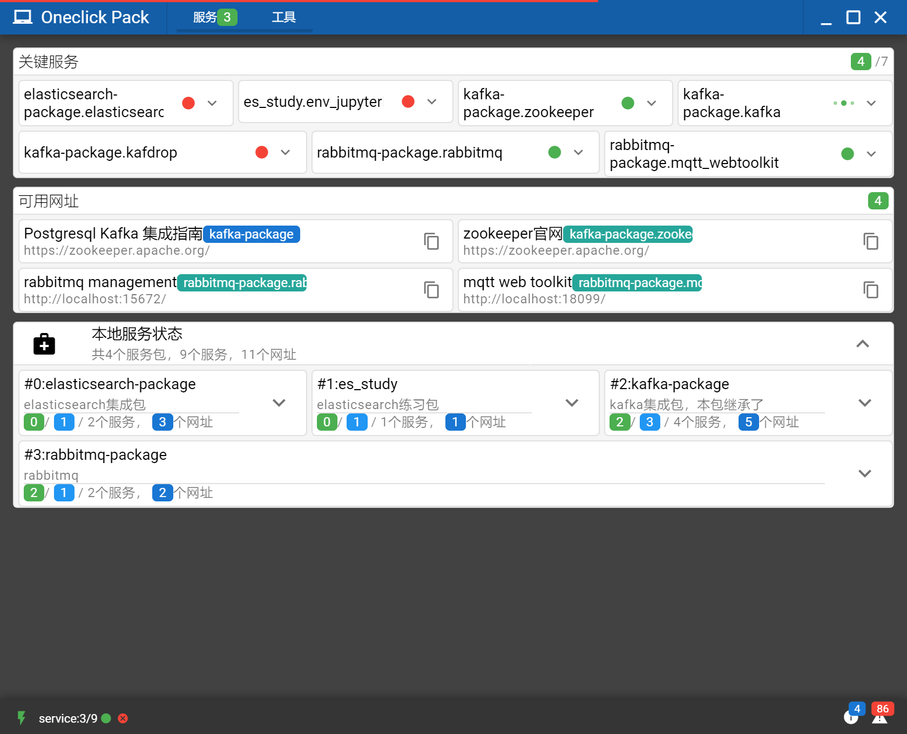

## Weero-OneclickPack

English\|简体中文

### 说明

OneclickPack是集成了python java erlang node等语言引擎的一款软件包分发工具；试想一下如下场景：

-   团队采用了大量的不同语言中间件（redis\\kafka\\rabbitmq\\progressql\\elasticsearch…），每个新加入的小伙伴都需要大量的时间在自己电脑上安装这些软件，团队成员也需要经常更新或统一各中间件的版本；

-   B/S结构的项目的分发依赖于服务器环境，需要很多的时间进行部署调试；

-   部署好的项目缺少一个可视化的管理界面，需要懂得大量中间件管理的专业的运维人员才能很好的进行管理；

-   Python java node的初学者将自己的代码发送到其他电脑，但因为pip jar npm等环境问题，无法正常运行。

OneclickPack的初衷是开发一个便携版（绿色版）的一键软件包管理工具，相比Docker它无需安装和复杂的配置，解压缩即可运行，您可以：

-   无需用户安装语言环境，可直接运行便携版软件包

-   双击运行，即可自动启动必须的中间件服务

-   可视化管理所有包含的服务和中间件

-   自动展示预设的url和启动命令，用户无需输入网址即可访问软件包内置的web服务

社区也提供了常用的中间件的软件包供下载，已整理的中间件如下：

-   Redis

-   Kafka(整合kafdrop、debezium)

-   Rabbitmq（整合wqtt web toolkit）

-   Elasticsearch（整合kibana）

-   陆续更新…

如下是包含了大量软件包的运行截图

  

### 目录结构

软件依赖于静态的目录结构如下：

~~~~~~~~~~~~~~~~~~~~~~~~~~~~~~~~~~~~~~~~~~~~~~~~~~~~~~~~~~~~~~~~~~~~~~~~~~~~~~~~
+c				关键依赖项/core服务主目录
---erl				erlang环境（可移除）
---jdk				java环境（可移除）
---python				python环境，安装了crossbar及其他的依赖包
---redis				redis中间件，用于Onclick Pack的临时数据存储
+datas			数据主目录
---_c					关键依赖项的持久化数据
---[…]				软件包的持久化数据（非必须）
+f				配置主目录
---.crossbar			crossbar服务的配置目录
---redis.conf			redis中间件的配置文件
+logs				日志主目录
---_c					关键依赖项的日志输出
---[…]				软件包的日志输入（非必须）
+py				core服务主目录（python语言）
---crossbar_api			crossbar的rpc、pubsub的处理程序、进程管理器
---rest_api				用于演示http restful api的站点
---[…]				客制化程序
+s				软件包主目录
---[…]				客制化软件包（非必须）
+ui					基于electron的客户端程序
---…
~~~~~~~~~~~~~~~~~~~~~~~~~~~~~~~~~~~~~~~~~~~~~~~~~~~~~~~~~~~~~~~~~~~~~~~~~~~~~~~~

本项目打包了python java 跟erlang环境，均为便携版/绿色版集成，启动设置均以项目内虚拟环境为主，理论上与本机环境不冲突。

-   Python PythonWin64_3.8.6

-   Java JDK build 15+36-1562

-   Erlang otp_win64_24.2.1

### 制作软件包

### Electron客户端

### Crossbar中间件

### Python Daemon

### 从源码编译

### 发行包
