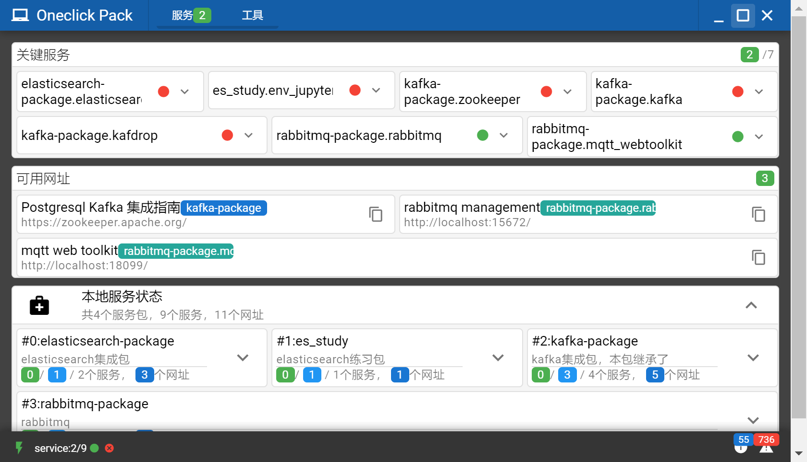
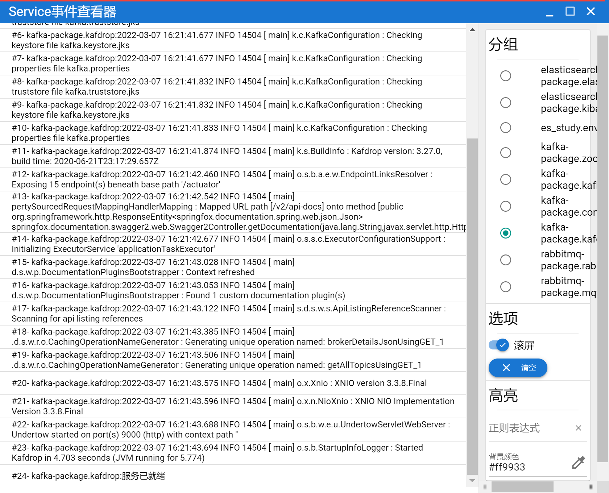
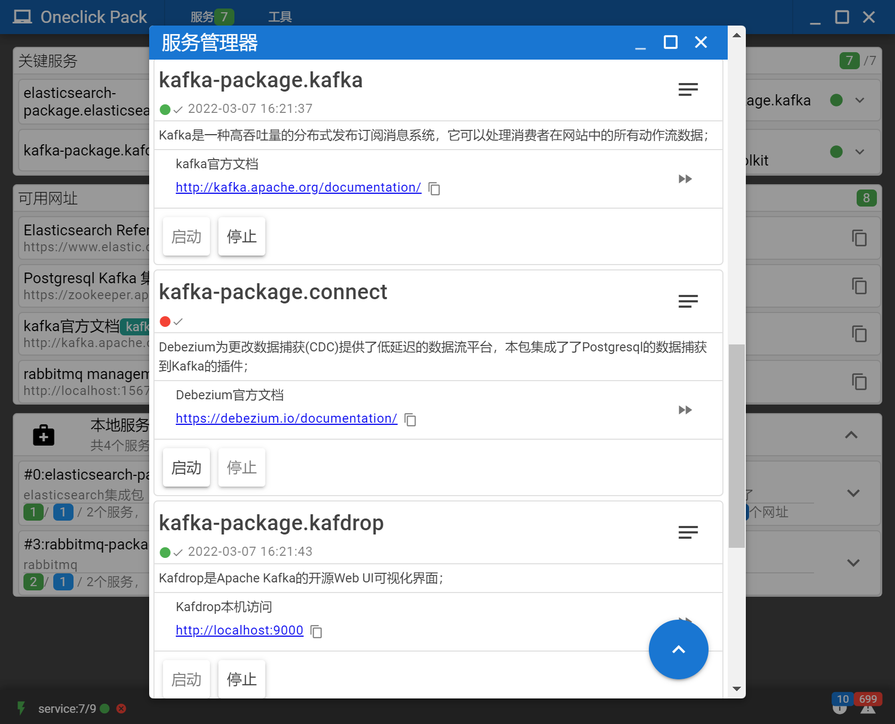
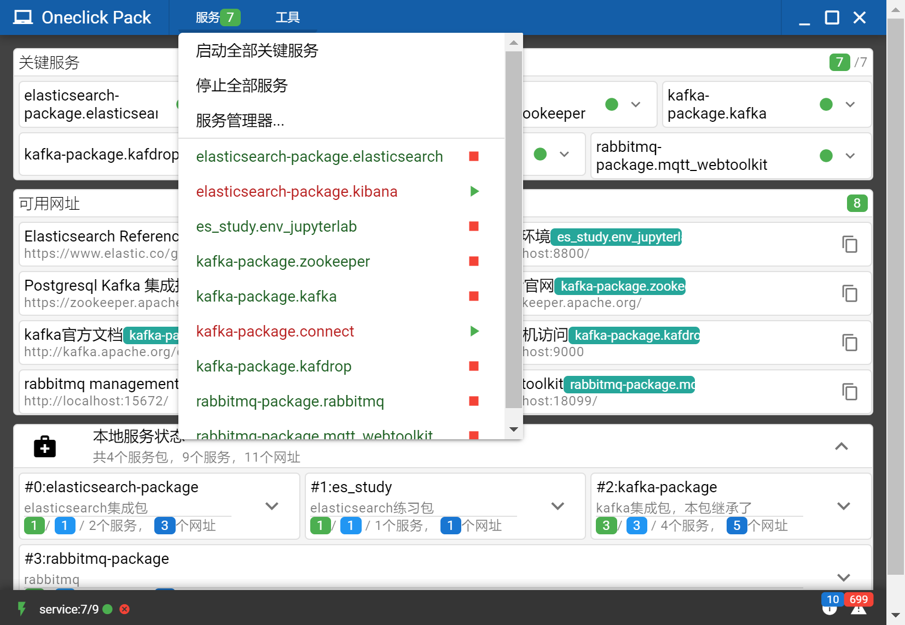
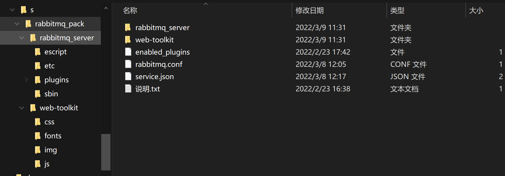

# Weero-OneclickPack

English\|简体中文

## 目录

[Weero-OneclickPack](#_Toc97822529)

[目录](#目录)

[说明](#_Toc97822531)

[目录结构](#_Toc97822532)

[制作软件包](#_Toc97822533)

[Electron客户端](#electron客户端)

[Crossbar中间件](#_Toc97822535)

[Python Daemon守护进程](#_Toc97822536)

[从源码编译](#_Toc97822537)

[软件包](#_Toc97822538)

[FAQ](#faq)

[裁剪分发包的体积：](#裁剪分发包的体积)

[在软件包中启动一个网站服务：](#在软件包中启动一个网站服务)

[Python代码无法捕获stdout：](#python代码无法捕获stdout)

## 说明

OneclickPack是集成了python java erlang node等语言引擎的一款软件包分发工具；试想一下如下场景：

-   团队采用了大量的不同语言中间件（redis\\kafka\\rabbitmq\\progressql\\elasticsearch…），每个新加入的小伙伴都需要大量的时间在自己电脑上安装这些软件，团队成员也需要经常更新或统一各中间件的版本；

-   B/S结构的项目的分发依赖于服务器环境，需要很多的时间进行部署调试；

-   部署好的项目缺少一个可视化的管理界面，需要懂得大量中间件管理的专业的运维人员才能很好的进行管理；

-   Python java node的初学者将自己的代码发送到其他电脑，但因为pip jar npm等环境问题，无法正常运行。

OneclickPack的初衷是开发一个便携版（绿色版）的一键软件包管理工具，相比Docker它无需安装和复杂的配置，解压缩即可运行，您可以：

-   无需用户安装语言环境，可直接运行便携版软件包

-   双击运行，即可自动启动必须的中间件服务

-   可视化管理所有包含的服务和中间件

-   自动展示预设的url和启动命令，用户无需输入网址即可访问软件包内置的web服务

社区也提供了常用的中间件的软件包供下载，已整理的中间件如下：

-   Redis

-   Kafka(整合kafdrop、debezium)

-   Rabbitmq（整合wqtt web toolkit）

-   Elasticsearch（整合kibana）

-   PostgresSql

-   陆续更新…

如下是包含了大量软件包的运行截图

  

可直接下载体验集成了rabbitmq的演示版：https://github.com/topabomb/OneClickPack/releases/tag/v0.0.1_preview

## 目录结构

软件依赖于静态的目录结构如下：

~~~~~~~~~~~~~~~~~~~~~~~~~~~~~~~~~~~~~~~~~~~~~~~~~~~~~~~~~~~~~~~~~~~~~~~~~~~~~~~~
+c				关键依赖项/core服务主目录
---erl				erlang环境（可移除）
---jdk				java环境（可移除）
---python				python环境及Daemon，安装了crossbar及其他的依赖包
---redis				redis中间件（可移除），用于Onclick Pack的临时数据存储
+datas			数据主目录
---_c					关键依赖项的持久化数据
---[…]				软件包的持久化数据（非必须）
+f				配置主目录
---.crossbar			crossbar服务的配置目录
---redis.conf			redis中间件的配置文件
+logs				日志主目录
---_c					关键依赖项的日志输出
---[…]				软件包的日志输入（非必须）
+py				core服务主目录（python语言）
---crossbar_api			crossbar的rpc、pubsub的处理程序、进程管理器
---rest_api				用于演示http restful api的站点，可移除
---[…]				客制化程序
+s				软件包主目录
---[…]				客制化软件包（非必须）
+ui					基于electron的客户端程序
---…
~~~~~~~~~~~~~~~~~~~~~~~~~~~~~~~~~~~~~~~~~~~~~~~~~~~~~~~~~~~~~~~~~~~~~~~~~~~~~~~~

本项目打包了python java 跟erlang环境，均为便携版/绿色版集成，启动设置均以项目内虚拟环境为主，理论上与本机环境不冲突。

-   Python PythonWin64_3.8.6

-   Java JDK build 15+36-1562

-   Erlang otp_win64_24.2.1

## 制作软件包

制作完成的软件包统一放在软件包主目录(/s)下，如rabbitmq包应为如下目录结构：

~~~~~~~~~~~~~~~~~~~~~~~~~~~~~~~~~~~~~~~~~~~~~~~~~~~~~~~~~~~~~~~~~~~~~~~~~~~~~~~~
+s				软件包主目录
---+rabbitmq_pack		客制化包-rabbitmq，目录名在本级唯一但可以自定义
------service.json	软件包的配置文件
------[…]			软件包的其他内容
~~~~~~~~~~~~~~~~~~~~~~~~~~~~~~~~~~~~~~~~~~~~~~~~~~~~~~~~~~~~~~~~~~~~~~~~~~~~~~~~

service.json 软件包配置说明

~~~~~~~~~~~~~~~~~~~~~~~~~~~~~~~~~~~~~~~~~~~~~~~~~~~~~~~~~~~~~~~~~~~~~~~~~~~ json
{
    "name": "rabbitmq-package", //软件包名称，需全局唯一
    "description": "rabbitmq", //软件包描述
    "version": "1.0.0", //当前版本
    "autoruns": [
        //配置需要自启动的服务数组，引用服务名称参见components中的名称
        "mqtt_webtoolkit"
    ],
    "requires": null, //依赖其他的软件包数组，引用软件包名称参见对应的service.json中的配置
    "urls": [
        //软件包需要展示的url数组
    ],
    "kwargs": {
        //附加参数
        "fix_wmic": "C:\\Windows\\System32\\wbem", //windows 下 wmic额外处理，修复PATH中无法找到wmic
        "fix_stop": "taskkill" //服务没有stop命令的情况下的停止处理，置为null使用terminate()退出进程，Windows下置为taskkill将使用taskkill中止进程
    },
    "components": [
        //软件包包含的服务数组
        {
            "name": "rabbitmq", //服务名称，软件包内唯一
            "requires": null, //依赖本软件包中其他服务的数组，引用对应服务的名称
            "cwd": "./rabbitmq_server/", //主目录，初始目录为软件包的根目录，即包含service.json的目录
            "bind_cwd": true, //相关命令是否采用包含主目录的完整路径
            "start": "sbin\\rabbitmq-server.bat", //启动命令
            "stop": null, //停止命令
            "ready_pattern": "^.*Starting broker... completed .*", //监控服务启动完成的正则表达式
            "check_point_pattern": null, //检查点的正则表达式，某些服务停止时依赖其他服务的状态，在stop_wait_check_points配置监控的目标服务
            "stop_wait_check_points": [], //在发出停止指令前需要监控的checkPoint，使用服务名数组
            "core_erl": true, //初始化erlang环境
            "core_java": false, //初始化java环境
            "envs": {
                //该服务启动时的环境变量清单，本例中配置RabbitMQ的本地化配置
                "RABBITMQ_MNESIA_BASE": "../../../datas/RabbitMQ/db",
                "RABBITMQ_LOG_BASE": "../../../datas/RabbitMQ/log",
                "RABBITMQ_ENABLED_PLUGINS_FILE": "../enabled_plugins",
                "RABBITMQ_CONFIG_FILE": "../rabbitmq.conf",
                "ERL_MAX_PORTS": "65535"
            },
            "urls": [
                //该服务关联的url清单
                {
                    "title": "Web管理插件",
                    "url": "http://localhost:15672/"
                }
            ],
            "description": "RabbitMQ是实现了高级消息队列协议（AMQP）的开源消息代理软件（亦称面向消息的中间件）。本服务开启了web_mqtt与management插件；" //服务描述
        },
        {//演示简化版的配置
            "name": "mqtt_webtoolkit",
            "requires": [
                "rabbitmq"
            ],
            "cwd": "./web-toolkit/",
            "start": "../../../c/python/python.exe -u -m http.server 18099 --directory ./",
            "ready_pattern": "^.*Serving HTTP on.*",
            "urls": [
                {
                    "title": "MQTT Web客户端",
                    "url": "http://localhost:18099/"
                }
            ],
            "description": "MQTT Web Toolkit 是 EMQ 最近开源的一款 MQTT (WebSocket) 测试工具。该工具采用了聊天界面形式，简化了页面操作逻辑，方便用户快速测试验证MQTT应用场景。"
        }
    ]
}
~~~~~~~~~~~~~~~~~~~~~~~~~~~~~~~~~~~~~~~~~~~~~~~~~~~~~~~~~~~~~~~~~~~~~~~~~~~~~~~~

## Electron客户端

[src/electron](docs/src/electron)包含了GUI程序的源码，程序框架及工具链采用Quasar，主要逻辑如下：

1.  解析命令行参数，初始化程序配置

2.  根据启动目录修改核心依赖的文件，例如erl.ini

3.  启动crossbar中间件（已将crossbar集成到python环境）

4.  启动redis中间件（可通过命令行—redis=false关闭）

5.  启动restApi（可通过命令行—restapi=false关闭）

6.  启动PythonDaemon(crossbarApi)

7.  渲染主界面

8.  渲染引擎启动各关键服务

## Crossbar中间件

Crossbar.io 是一个用于分布式和微服务应用程序的开源网络平台。它实现了开放的 Web 应用程序消息传递协议 (WAMP)，功能丰富、可扩展、健壮且安全。

本例中用作消息中间件，gui启动时将自动启动该服务，服务配置在/f/.crossbar中。

注册的RPC清单参见/dist/py/crossbar_api/rpc_sets中的代码

使用的Pub/Sub频道：

-   core.sevice.print：子服务的日志输出（python daemon publish）

-   core.sevice.status：子服务的状态输出（python daemon publish）

-   core.console.out：core服务的日志输出（electron gui publish）

## Python Daemon守护进程

Python语言的守护进程，用于子服务的进程管理，公布了crossbar的RPC方法用于gui进行控制。

为什么笔者不直接用node而要另外撰写python的代码，其实是笔者自身的原因，强迫自己在项目中使用多种开发语言，这样有助于碰到某个语言环境不能或很难完成工作时，还是可以快速的通过其他语言环境完成需求。（比如有需要cuda开发，如果只熟悉node的话该怎么实现/2021年的实际场景）

源码参见/dist/py/crossbar_api/

## 从源码编译

Electron项目主目录/scr/electron，编译完成后windows的未打包版本在/src/electron/dist/electron/Packaged/win-unpacked 下

~~~~~~~~~~~~~~~~~~~~~~~~~~~~~~~~~~~~~~~~~~~~~~~~~~~~~~~~~~~~~~~~~~~~~~~~~~~~~~~~
npm install
npm run build
~~~~~~~~~~~~~~~~~~~~~~~~~~~~~~~~~~~~~~~~~~~~~~~~~~~~~~~~~~~~~~~~~~~~~~~~~~~~~~~~

## 软件包

-   RabbitMQ Pack

-   Kafka Pack

-   Elasticsearch Pack

-   PostgresSql Pack

-   ……

## FAQ

### 裁剪分发包的体积：

-   如果分发的软件包不依赖java环境，可删除\\c\\jdk目录，可节省161m空间；

-   如果分发的软件包不依赖erlang环境，可删除\\c\\erl目录，可节省302m空间；

-   如果不依赖redis环境，可删除\\c\\redis目录，同时通过命令行参数要关闭redis与restapi；

-   清理\\c\\datas 与\\c\\logs目录

-   可以通过\\c\\python\\python.exe -m pip 清理不需要的包（请小心操作，crossbar、autobahn及其相关的依赖一定不要删除）

-   压缩并重新打包python环境。（压缩打包site-packages，注意python38._pth的修改）

### 在软件包中启动一个网站服务：

Python环境自带一个简单的web服务器，参考如下命令

c/python/python.exe -u -m http.server 18099 --directory ./

### Python代码无法捕获stdout：

Python的pring及loggin包的stdout输出默认采用了Buffer机制，过于少量的输入会积压在内存中不会刷新到管道，使用python -u 参数禁止Buffer机制。
